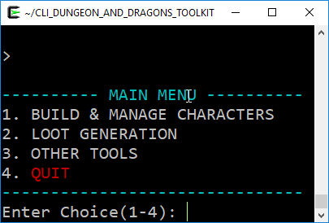
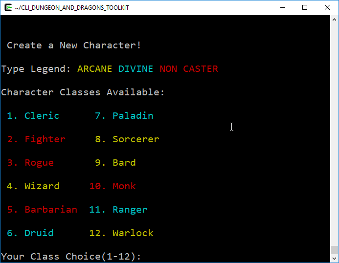
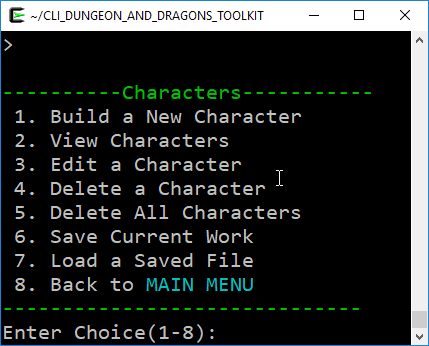
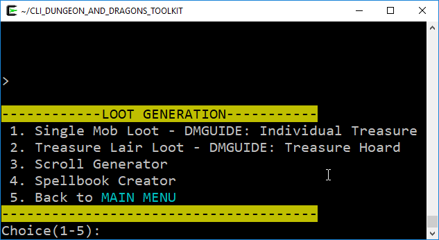
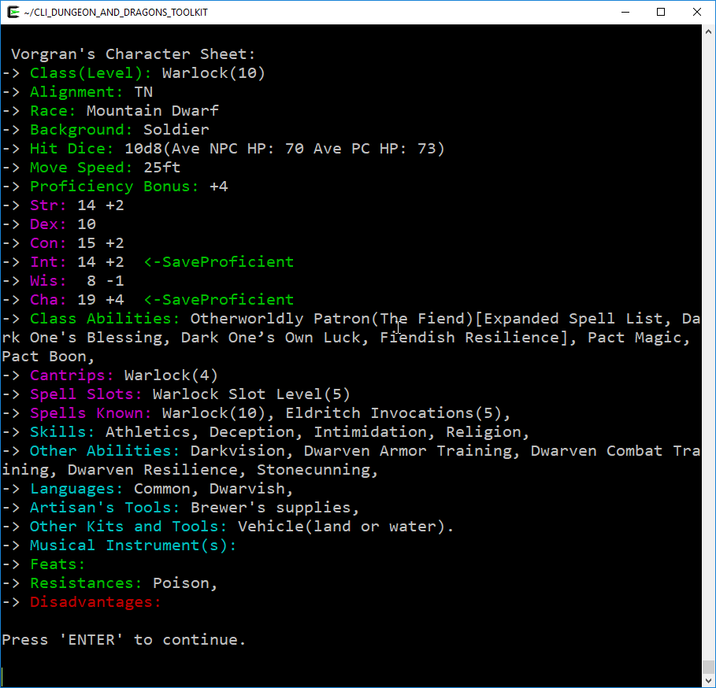

# Dungeon Master Power Core Version (DMPOWER)









### 0. Index

1. [Introduction](#1-introduction)
2. [How To Run DM Power](#2-how-to-run-dm-power)
3. [Character Builder](#3-character-builder)
4. [Reward Loot](#4-reward-loot)
5. [Kismet's Random Name](#5-kismets-random-name)
6. [Other Tools](#6-other-tools)
7. [Credits](#7-credits)
8. [Dev](#8-dev)
9. [ToDo](#9-todo)

---

### 1. Introduction
       
My original plan was to create a helpful program for me as a Dungeon Master. Anything that could save me precious minutes of game time and keep it the same old D&D, just better and faster.

* This tool is best suited for Dungeon Masters.  
* Tools marked  are the ones I found myself using the most, give them a shot.
* All rolls and generator randomness done with [Mersenne Twister](https://en.wikipedia.org/wiki/Mersenne_Twister), arguably the best randomizer out there.
* Uncrashable. I've taken measures to make sure the end user cannot accidentally crash the program. You can do no wrong. Go crazy testing.

[back to index](#0-index)

---

### 2. How To Run DM Power       

_DMPOWER is a Command Line Interface program_

* Linux. From Command Line -
    1. c++11 dependencies
        * ````sudo apt-get update````
        * ````sudo apt-get install build-essential make gcc git````
    2. clone from github
        * ````git clone https://github.com/bytePro17124/DMPOWER````
    3. move to directory
        * ````cd DMPOWER````
	4. compile 
		* ````make````
	5. run 
		* ````./dmpower````
	9. or compile and run 
		* ````make run````
* Windows. Should work the same as Linux with [Cygwin](https://www.cygwin.com/) or [WSL](https://msdn.microsoft.com/commandline/wsl/about)
* MacOS. Untested but should work about the same as linux.

[back to index](#0-index)

---

### 3. Character Builder



_Build and Manage Player Characters_

*  Walk through the prompts to create a full character _by the book_
    * Save & Load, levels 1 to 20, versatile starting stat options, leveling up auto prompts new options.
    * All Classes, Races, Paths, Feats, Skills, Proficiencies, Backgrounds
    * EVERY OPTION from three official 5th edition books 
        1. Player's Handbook
        2. Dungeon Master's Guide (adds evil paladin paths and a few others)
        3. Sword Coast Adventurer's Guide (adds class archetype paths, backgrounds, and a few other things)  
    * Limitations : Doesn't handle equipment, spell choices, or multiclassing

[back to index](#0-index)

---

### 4. Reward Loot

_Magic Item / Reward Roller (by the DM Guide)_

*  Scroll and Spellbook Generators : Randomized
*  Loot Rollers : by the book. Try out the Roll Horde Loot option for some fun.

[back to index](#0-index)

---

### 5. Kismet's Random Name

*  Name Generator. 7732 names from Kismet's list randomized. Great for planning and on the fly naming.   

[back to index](#0-index)

---

### 6. Other Tools

* Party Experience Calculator. Total up session or encounter experience (based on CR's overcame) and split it with the party. Pretty straightforward, could use some UI improvements but it is fully functional.
* Insult Generator. NSFW. For when you just need to anger the PC's or antagonize them with a baddie. I just threw this in for fun. It takes two lists from files and randomly combines words, easily adapted to new words by editing the settings file.
* Posion prices chart, madness chart, and more. 

[back to index](#0-index)

---

### 7. Credits
  
* Designed for Dungeons & Dragons 5th Edition Official. The data is (mostly) from:
 
 | [Player's Handbook](http://dnd.wizards.com/products/tabletop-games/rpg-products/rpg_playershandbook) | [Dungeon Master's Guide](http://dnd.wizards.com/products/tabletop-games/rpg-products/dungeon-masters-guide) | [Sword Coast Adventurer's Guide](http://dnd.wizards.com/products/tabletop-games/rpg-products/sc-adventurers-guide) |
 | --- | --- | --- |
 | [](http://dnd.wizards.com/products/tabletop-games/rpg-products/rpg_playershandbook) | [](http://dnd.wizards.com/products/tabletop-games/rpg-products/dungeon-masters-guide) | [](http://dnd.wizards.com/products/tabletop-games/rpg-products/sc-adventurers-guide) |

* All Code by [**_Matthew Jay Early_**](https://twitter.com/matthewjayearly) 

[back to index](#0-index)

---

### 8. Dev

* Feel free to reach out about anything. Feel free to correct stuff and make pull requests.
    * To really get involved, the following skills will be handy: C++, SDL2 Library, Image & Audio editing , Dungeons & Dragons 5e Knowledge
* Email : [matthewjearly@gmail.com](mailto::matthewjearly@gmail.com) 
* Tweet : [**_@matthewjayearly_**](https://twitter.com/matthewjayearly) 
* Help! [](https://www.paypal.com/cgi-bin/webscr?cmd=_s-xclick&hosted_button_id=45RLH5HDMQZYC)
    * Any proceeds go towards the continued development of this program. 
    * If you want to help but cannot donate: any comments or testing is greatly appreciated. 

[back to index](#0-index)

---

### 9. ToDo 

1. build interfaced version that works on any OS
2. improve tools

[back to index](#0-index)
