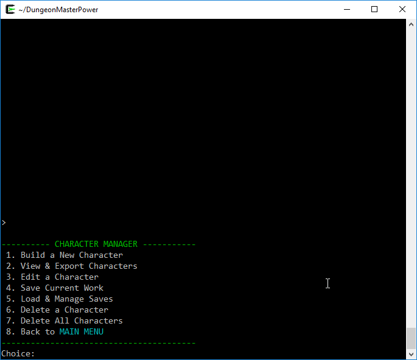
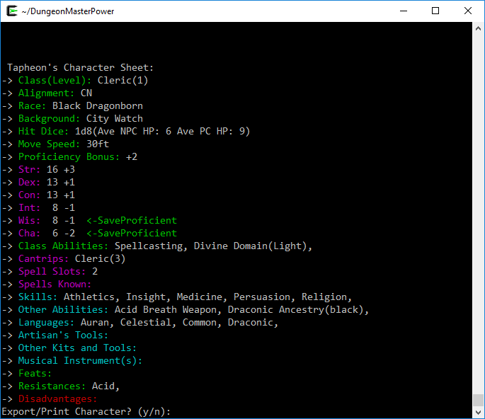
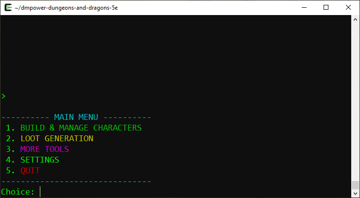
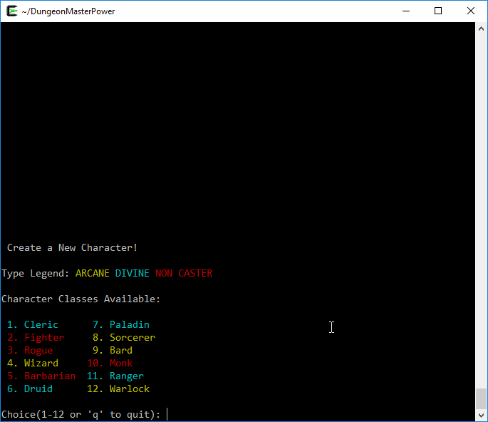
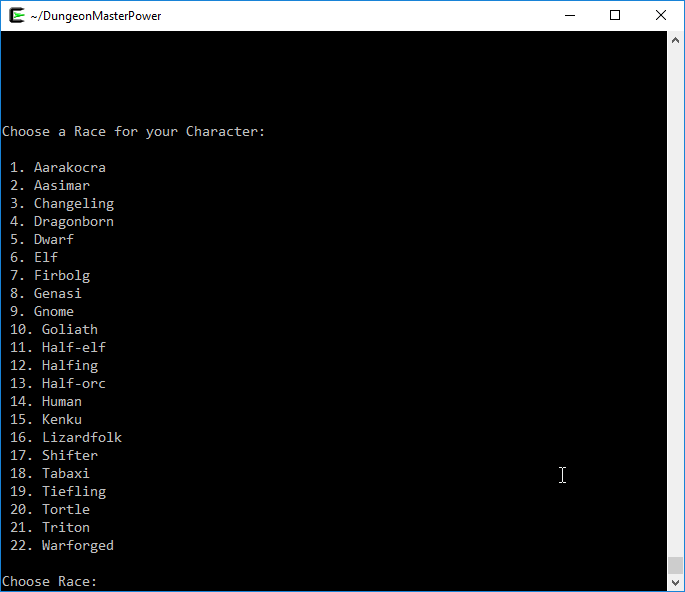
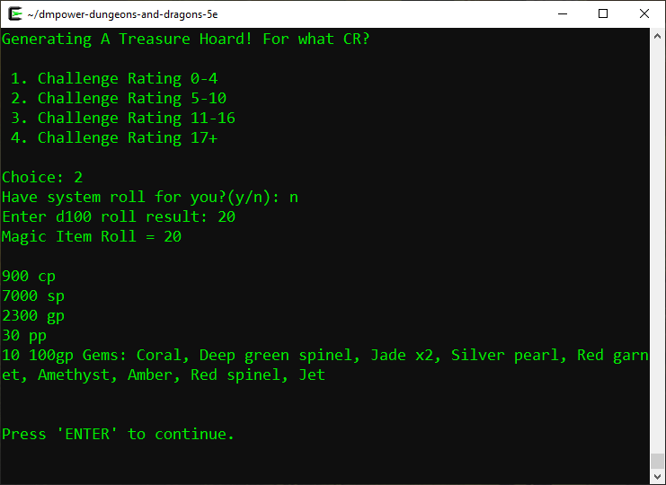
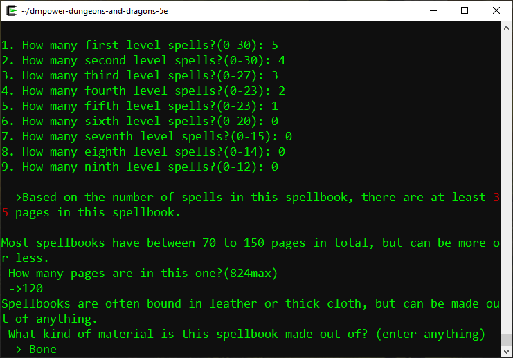
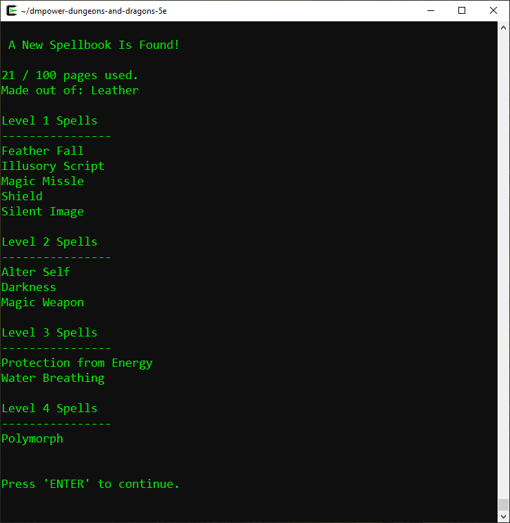

DungeonMasterPower is an interactive terminal-based D&D5e toolkit. Its use is intended for Game Masters to aid in game prep and on the fly assistance.

 
 

[DMPOWER BUILD 6 VIDEO](https://youtu.be/9VJpPyqnssY)

### Run on Linux

- Open terminal, clone master or download release, then build and run.

````
git clone https://github.com/mattearly/DungeonMasterPower.git
cd DungeonMasterPower/
make run
````

- `make run` builds and runs the program right away. There are other make options. Try `make help` to see other options.
- go install dependencies if something fails in the build, then try again. If you are using debian, the packages you will need are:

````
make gcc libboost-filesystem-dev
````

- run once built

````
./DungeonMasterPower
````

### Run on Windows

Use [Cygwin](https://www.cygwin.com/), or [WSL](https://msdn.microsoft.com/commandline/wsl/about), or mingw, or Powershell. Pretty much anything you can get the dependencies on it will work with.

- If you are using Cygwin, you will need the packages `gcc-core`, `make`, `libboost-devel`, and of course `git` for the git clone command, then it should work just like the linux build and run above.
- In case of using the Powershell terminal, you will need to activate the ansi color escape with this command:
  - `Set-ItemProperty HKCU:\Console VirtualTerminalLevel -Type DWORD 1`
  - [more discussion on this topic](https://stackoverflow.com/questions/51680709/colored-text-output-in-powershell-console-using-ansi-vt100-codes)
- I have not tested with Visual Studio. Should work but may need some modifications or project setup.

### Run on Mac

I haven't tested but it should work fine, may need homebrew for boost libraries.

# Additional Notes

This tool is best suited for Dungeon Masters and doing stat blocks for characters, treasures, & the like; ideally saving you tons of time and making your planning much much faster so you and you're players can focus more on the story.

This toolkit does not teach the game or say many specifics about what each ability, magic item, or spell does, as that is just not the intention. These details can be found on from D&D Beyond or their books or as otherwise referenced in the Credits below.

I tend to update this based on what 'I' need and based on requests. If there is something you would like to see added, feel free to let me know.

# Foundation / Why this program?

A quick story. I decided to start making this tool on my own accord when I, as a DM, couldn't find any D&D software that I liked. This was sometime around late 2015 while I was in college studying Comp Sci and on occasion playing D&D with a few friends. I had a long background of being a DM so I new pretty well what I needed in a tool and I needed a project to work on outside of class, and C++ was what I was learning at the time. At first I was just seeing what I could do, but eventually it grew to be usable and I've been tweaking and expanding it ever since. 

I choose not to steer away from C++ because I like this being fast, responsive, and reliable. C++ allows me to be as meticulous as I prefer (yeah I see all your slow crashing web sites trying to do this stuff). You can run this tool reliably on the oldest of machines and it should still seem fast.

So, how can you say no to making a NPC/PC character in about 1-2 minutes? Sure beats the usual 1-2hr character building sessions we all have experienced... sometimes painfully experienced. With this you get your stats all set without having to dig through books for potential options. You can go straight to the important part: story, gear, and what makes your character unique. If you are a wizard you can even get a randomized Spellbook from DungeonMasterPower if that's your thing. 

And oh my... speaking of spellbooks, have you ever found a Spellbook in game? How much time did that take? With this program it can be done quickly, reliably and randomly. The amount of time I've lost in the past trying to figure out "what spells..." Never again. 

Can we talk about putting treasure in a dungeon? Say you are populating a dungeon - Try rolling Lair Treasure and pepper it in, add pieces to your monsters, or whatever you like. I found that works quite well.

I still play D&D on occasion, and when I do, I use this tool. It makes the experience so much less stressful and (down)time consuming. So here I am now, still working on this piece of software, showing it to the world now even though it was originally just intended for my personal use.

# Dev Road Map

Varies. This is not a funded project, so it depends on how busy I am with real life and how much D&D I'm playing.

# Support

Share this project with a friend and/or give it a star to support this project.

# Credits

The list of abilites and items are from various DD& books. Nothign has been added from the pending ones yet.

* [Player's Handbook](http://dnd.wizards.com/products/tabletop-games/rpg-products/rpg_playershandbook)
* [Dungeon Master's Guide](http://dnd.wizards.com/products/tabletop-games/rpg-products/dungeon-masters-guide)
* [Sword Coast Adventurer's Guide](http://dnd.wizards.com/products/tabletop-games/rpg-products/sc-adventurers-guide)
* [Volo's Guide to Monsters](http://dnd.wizards.com/products/tabletop-games/rpg-products/volos-guide-to-monsters)
* [Wayfinder's Guide to Eberron](https://www.dmsguild.com/product/247882/wayfinders-guide-to-eberron-5e)
* pending ~~[Xanathar's Guide to Everything]()~~
* pending ~~[Guildmaster's Guide to Ravnica]()~~
* [The Tortle Package](https://www.dmsguild.com/product/221716/Tortle-Package-5e)
* pending ~~[Mordenkain's Tome of Foes]()~~
* [Elemental Guide of Evil](https://www.dmsguild.com/product/145542/Elemental-Evil-Players-Companion-5e)

Trying to keep DungeonMasterPower based on offical stuff so that this program will be helpful for everyone. However there are some additional sources used.

* [Kismet's Name List](http://www.dnd.kismetrose.com/MyCharacterNameList.html)
* [Resolving Basic Behavioral Problems in your Tabletop RPG Group: A Flowchart](https://www.reddit.com/r/rpg/comments/3avp57/resolving_basic_behavioral_problems_in_your/)

# Contributing

See the [CONTRIBUTING](CONTRIBUTING.md) file for more information on how you can help with the code, and of course, feel free to correct or report any typos or issues you find.

# Legal
DungeonMasterPower is not affiliated with, endorsed, sponsored, or specifically approved by Wizards of the Coast LLC. Dungeons & Dragons® is a trademark of Wizards of the Coast. For more information about Wizards of the Coast or any of Wizards' trademarks or other intellectual property, please visit their website at dnd.wizards.com.

# Some Additional Screenshots

 
 

 
 

 
 