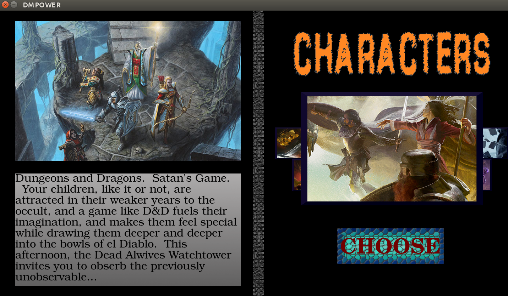

_Expected Release Date: Q4 2017_

[](https://www.paypal.com/cgi-bin/webscr?cmd=_s-xclick&hosted_button_id=982RBXVEKD9Z8)

This Branch is Not Fully Functional. However the [master_cstd11](https://github.com/bytePro17124/DMPOWER/tree/master_cstd11) branch is and runs in command line.

# The DMPOWER project


* My original plan was to make a complete program that can aid in keeping your tabletop D&D game going, and with very little downtime and prep from the dungeon master working on the fly.
* It is basically, _the program I've always wanted but could never find._ 
* Designed for Dungeons & Dragons 5th Edition and is best suited for Dungeon Masters (specifically designed for me personally, I'm just building what I would want). Players may also enjoy it for the character building functions.  


### Features 2 big tools, and a few smaller ones.
1. **Building Player Characters.** Build and Manage Characters. This feature might be useful for Players too.
    * Walk through and answer the prompts to create a full character by the book.  
    * All Classes, Archetype Paths, Races, Feats, Skills, Proficiencies, Backgrounds, and Stats  
        * from the 5e books: Dungeon Master's Guide, Player's Handbook, and Sword Coast Adventurer's Guide.  
    * Level 1-20. Character Editor for leveling up and making changes anytime  
    * Load and Save fully functional for characters.  
2. **Figuring Out Reward Loot.** Magic Item Roller, Scroll and Spellbook Generators. **In my experience while DMing and planning, I've noticed this is the program's gem.**  
    * All Loot Reward rolling charts from the DMG. Magical items, gems, art, currency.
        * done by the book's logic - any rolled scrolls are automatically ran through the Random Scroll Generator. **This feature turned out to be quit helpful in my live games as well. Saves tons of time**
    * Spellbook creator that randomizes wizard spells, just tell it how many of each level and it does the rest. Perfect for when a player asks 'What is in this stolen/looted NPC wizard spellbook?'   
    * Random Scroll generator, just tell it what level scroll and it gives a random spell of that level.
3. **Additional Tools**  
    * Party Experience Calculator.  
	   * Total up session or encounter experience and split it with the party. This feature is pretty straightforward.  
    * Name Generator.  
        * 7732 names from Kismet's list randomized. Super nice for when the players just keep asking what the NPC's names are that you didn't plan in advance.  
    * Insult Generator.  
	   * For when you just need to piss off the PC's or antagonize them with a baddie. I just threw this in for fun.
    * And More, I've probably left something out.

#### How do you run this?  

* You will need:
	* sudo apt-get install libsdl2-dev libsdl2-image-dev libsdl2-ttf-dev libsdl2-mixer-dev
	* linux, c++11, and the SDL2 libraries to compile this. ````sudo apt-get install libsdl2-dev libsdl2-image-dev libsdl2-ttf-dev libsdl2-mixer-dev````
	* Once you have those, you can clone it, run ````make```` to build it, and then ````./dmpower```` in the terminal to launch the program

#### Problems?
  
* If you run into a problem or something unclear - please open an issue ticket or email me. The more details the better.  
* Anything you would like to see added to this program - open a issue ticket with the enhancement tag or email me.  


###### About

* All Code by **_Matthew Jay Early_** 
* This program doesn't replace them or go into details about what abilities, spells, and items do, so you'll be lost without the books.  
* Material and Data (other than the names and insult lists) by Wizards of the Coast  
* Email me at _matthewjearly@gmail.com_  
* Why did I go through the pain of making this? Ever since I started playing D&D many years ago, I began looking for useful programs to go along with the game. There seemed to be a million little half-built tools and websites or many that don't follow the rules enough to be both useful and fair. I wasn't interested in a random person's homebrew ideas, which ruled out 90% of what I found. Since I couldn't find a program that did all this stuff legit from the books, and even Wizard's paid programs are too convoluted to be of use during gameplay, in my opinion, I decided to hack it myself. It also gave me something to work on while not taking classes and a motive to keep programming.  


#### Support
The best way to  help out at this point is to Donate any amount of Mula, even a tiny bit helps and will motivate me to work on this more.  
* [PayPal](https://www.paypal.me/mattearly/)  
* Bitcoin: 1Nwi1GBJtsuo1WQJqK83Ckr5NDJ3zwi5mM  


#### ToDo
* build interfaced version
