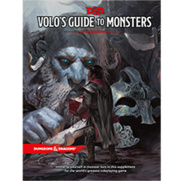

# About

[Dungeon Master Power](https://github.com/mattearly/DungeonMasterPower/releases) is a powerful minimalistic interactive terminal-based Dungeons & Dragons's 5th Edition Toolkit. The intention is to make being the Dungeon Master less tedious and time consuming so you can focus more on your game's story, and less on looking up charts. See the [MANUAL](MANUAL.md) for screenshots and information about the ever-evolving toolset.

# Getting Started

Dungeon Master Power runs in a terminal on any operating system and uses text coloring that will look best in a terminal with a solid dark background.

## Prerequisites

C++ Standard 11, Boost filesystem, and Make

### Run on Linux

 - Open terminal, clone master or download release, then build and run.

````
git clone https://github.com/mattearly/DungeonMasterPower.git
cd DungeonMasterPower/
make run
````

- `make run` builds and runs the program right away. There are other make options. Try `make help` to see other options.
- go install dependencies if something fails in the build, then try again. If you are using debian, the packages you will need are:

````
make gcc libboost-filesystem-dev
````

- run once built

````
./dmpower
````

### Run on Windows

Use [Cygwin](https://www.cygwin.com/), or [WSL](https://msdn.microsoft.com/commandline/wsl/about), or mingw, or Powershell. Pretty much anything you can get the dependencies on it will work with.
- In case of using the Powershell terminal, you will need to activate the ansi color escape with this command:
  - `Set-ItemProperty HKCU:\Console VirtualTerminalLevel -Type DWORD 1`
  - [more discussion on this topic](https://stackoverflow.com/questions/51680709/colored-text-output-in-powershell-console-using-ansi-vt100-codes)
- I have not tested with Visual Studio. Should work but may need some modifications or project setup.

### Run on Mac

I haven't tested but it should work fine, may need homebrew for boost libraries.

# Additional Notes

- This tool is best suited for Dungeon Masters, however the character creator could be helpful for anyone.
- This toolkit does not teach the game or say many specifics about what each ability, magic item, or spell does, as that is just not the intention. These details can be found on the plethora of reference data sites and apps related to D&D 5e, as well as in the official books.

# Foundation / Why this program?

A quick story. I decided to start making this tool on my own accord when I, as a DM, couldn't find any D&D software that I liked. This was sometime around late 2015 while I was in college studying Comp Sci and on occasion playing D&D with a few friends. I had a long background of being a DM so I new pretty well what I needed in a tool and I needed a project to work on outside of class, and C++ was what I was learning at the time (so that's why this is all C++ and not something easier). At first I was just seeing what I could do, but eventually it grew to be usable, and everyone wanted to make their characters with it, which was cool and motivated me to keep going. Also, I just love the treasure rolling tools, they're so great for planning.

How can you say no to making your D&D character in about 1 minute? Sure beats the usual 1-2hr character building sessions we all have experienced... sometimes painfully experienced. With this you get your stats all set without having to dig through books and check every bit of logic. You can go straight to the important part: story, gear, and what makes your character special. If you are a wizard you can even get a randomized Spellbook from dmpower if that's your thing. 

And oh my... have you ever found a Spellbook in game? How much time did that take? With this program it can be done quickly, reliably and randomly. The amount of time I've lost in the past trying to figure out "what spells..." Never again.

So here I am now, still working on this piece of software. 

# Support

Hey you got this far, thank you for your intrest! If you'd like to help progress this program, consider donating to help keep the lights on. Also, sharing and using the program helps out too, so feel free to let your friends know about it.

- [](https://www.paypal.me/mattearly) 

Any donations will go towards finding and funding time to continue work on this project. The more support I can get the faster this toolkit can advance. This will include improvements, more additions, and more attention.

# Credits

The core D&D data used in this program is from:

 | [Player's Handbook](http://dnd.wizards.com/products/tabletop-games/rpg-products/rpg_playershandbook) | [Dungeon Master's Guide](http://dnd.wizards.com/products/tabletop-games/rpg-products/dungeon-masters-guide) | [Sword Coast Adventurer's Guide](http://dnd.wizards.com/products/tabletop-games/rpg-products/sc-adventurers-guide) | [Volo's Guide to Monsters](http://dnd.wizards.com/products/tabletop-games/rpg-products/volos-guide-to-monsters) |
 | --- | --- | --- | --- |
 | [](http://dnd.wizards.com/products/tabletop-games/rpg-products/rpg_playershandbook) | [](http://dnd.wizards.com/products/tabletop-games/rpg-products/dungeon-masters-guide) | [](http://dnd.wizards.com/products/tabletop-games/rpg-products/sc-adventurers-guide) | [](http://dnd.wizards.com/products/tabletop-games/rpg-products/volos-guide-to-monsters) |

Programmers as accredited in the commit history and contributers file - mostly me but its always nice to have help and I will accept some modifications on a case by case basis if they align with the overall goal of dmpower. See the [CONTRIBUTING](CONTRIBUTING.md) file for more information on how you can help with the code, and of course, feel free to correct or report any typos or issues you find.
